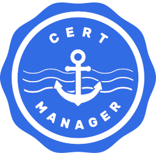

# Cert-Manager Cluster Issuer Components Custom Helm Chart



* Resources
  * ClusterIssuer

Cert-Manager Helm chart

## Chart Testing

* Test deploying release against kubeadm cluster

```bash
helm install cert-manager-issuers charts/cert-manager-issuers --dry-run --debug
```

* Deploy release without testing

```bash
helm install cert-manager-issuers charts/cert-manager-issuers
```

## Values

| Key | Type | Default | Description |
|-----|------|---------|-------------|
| clusterIssuer.letsencrypt.name | string | `"letsencrypt-staging"` | Cluster issuer name |
| clusterIssuer.letsencrypt.name.acme.email | string | `"no-reply@jamf.com"` | Certificate email |
| clusterIssuer.letsencrypt.name.acme.server | string | `"https://acme-staging-v02.api.letsencrypt.org/directory"` | Letsencrypt endpoint |
| clusterIssuer.letsencrypt.name.acme.privateKeySecretRefName | string | `"letsencrypt-staging"` | Secret to store certificate |
| clusterIssuer.letsencrypt.solvers.dns01.route53.region | string | `"${awsRegion}"` | AWS availability zone |
| clusterIssuer.privateCa.chaos.name | string | `"jamf-chaos-io"` | Name of self-signed private ca |
| clusterIssuer.privateCa.chaos.ca.secretName | string | `"jamf-chaos-io-secret"` | Certificate secret |

> **Tip**: You can use the default [values.yaml](values.yaml)

### Upgrading an existing Release to a new major version

A major chart version change (like 1.2.0 -> 2.0.0) indicates that
there is an incompatible breaking change needing manual actions.

## Maintainers

| Team | Email |
| ---- | ------ |
| kube-express | no-reply@jamf.com |

## Docs

* [cert-manager](https://cert-manager.io/docs/)
